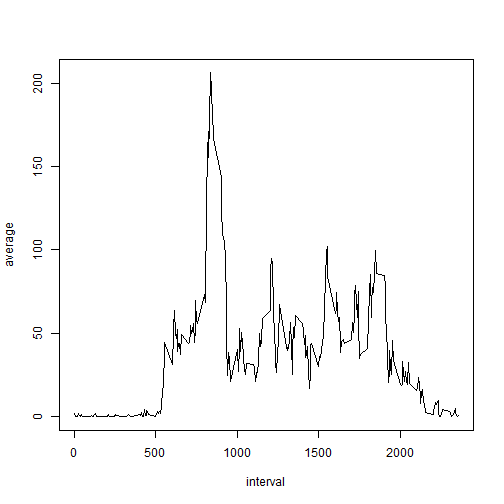

Peer Assignment 1, by SMinkes
===========================================================

Load the data in a suitable format


```r
data <- read.csv("activity.csv", header=TRUE, sep=",")
```

Load the required packages for calculating the total number of steps


```r
install.packages("plyr")
library(plyr)
install.packages("lattice")
library(lattice)
```

Calculate the total number of steps taken per day


```r
num_steps <- ddply(data, c("date"), summarise, sum = sum(steps), mean = mean(steps, na.rm=TRUE))
```

Create a Histogram


```r
hist(num_steps$sum)
```

 

Calculate the mean and the median


```r
mean(num_steps$sum, na.rm=TRUE)
```

```
## [1] 10766.19
```

```r
median(num_steps$sum, na.rm=TRUE)
```

```
## [1] 10765
```

Calculate the 5 min interval averages


```r
five <- ddply(data, c("interval"), summarise, average = mean(steps, na.rm=TRUE))
```

Plot the 5 min intervals

```r
plot(five, type="l")
```

 

Calculate the max


```r
maxrow <- five[which.max(five$average),]
maxrow$interval
```

```
## [1] 835
```

Calculate the number of missing steps


```r
length(which(is.na(data$steps)))
```

```
## [1] 2304
```

Impute missing values with a zero and save it in a new data frame


```r
new <- replace(data, is.na(data), 0)
```


Create a new plot and calculate the mean and the median

```r
new_steps <- ddply(new, c("date"), summarise, sum = sum(steps))
hist(new_steps$sum)
```

 

```r
mean(new_steps$sum)
```

```
## [1] 9354.23
```

```r
median(new_steps$sum)
```

```
## [1] 10395
```

Create a function to determine whether a day is in the weekend or is a weekday. Apply the function to each day in the list


```r
weekend <- function(date) {
  day <- weekdays(as.Date(as.character(date), "%Y-%m-%d"))
  if(day == "Sunday" || day == "Saturday") {
    day <- "weekend" 
  } else {
    day <- "weekday"
  }
  as.factor(day)
}

new$day <- sapply(new$date, weekend)
```

Plot the panel plot

```r
panel_plot_data <- ddply(new, c("day", "interval"), summarise, average = mean(steps))
xyplot(average ~ interval | day, data = panel_plot_data, layout = c(1,2), type="l")
```

 
